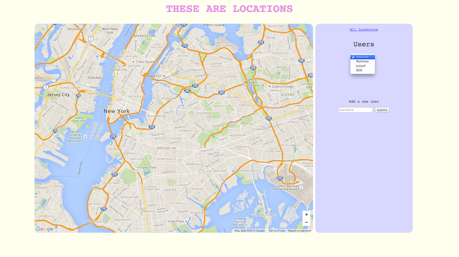
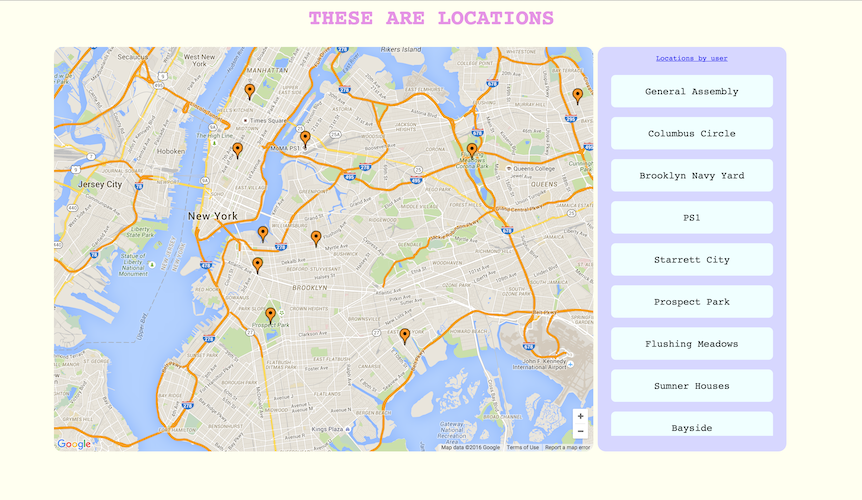
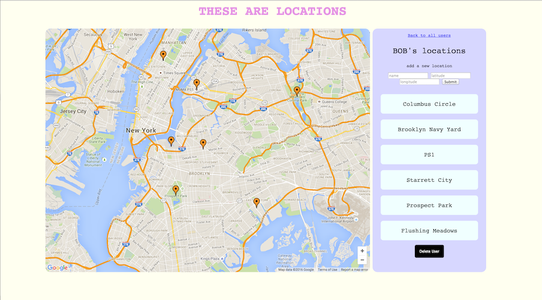

# MAPS & MULTIPLE MODELS

```
- subdocuments and referencing between models

- program flow

- getting server data into static javascript files / Google Maps
```


## App

Pages:
  
- Users index
  - Has a dropdown menu of all users. When the option is changed, the page goes to the user's show page
  - Has a form for creating a new user
  	- redirects to new user's show page
  - Has a link to see all locations 
  - Nothing on the map



- Locations index
  - Has a list in the control panel of all locations from all users
  - Displays all locations on a Google Map
  - A link to see locations by user (users index)

 

- Users show
  - User's name is there
  - Shows just this user's locations
  - Has a form to add a new location for this user
  	- redirect back here to user's show page
  - Has a delete button
    - deletes user and associated locations. Deleted locations should not show up on the locations index.
  

  
## Data modeling

A user should have at minimum:

```
username: String
```

and a Location should have at minimum:

```
name: String,`
lat: Number,
lng: Number
```

But what else is needed to specify a relation between these two models in regards to our program flow? Answer: subdocuments, at least.
 


## Data, AJAX, and Static files

The Google Maps stuff is all front-end static JS. It is not constructed with input from the server or server-rendered templates. However, we want to get data on to the map, because each marker is positioned according to lat and lng values stored in the database.

How can we get server / database data into our static JS files?

In the locationsIndex.js file in the public folder, underneath the Maps setup there is a jQuery ajax call to get the data to put in the Markers. Ajax is a way to pull data from remote urls. In this case, we're just pulling our own data from our server. The ajax call is looking for JSON, so you will need to make a route that just serves up JSON, and the ajax will pick it up.

You may or may not want to use ajax on your user show page, too. However, you will need to get creative as to how your javascript file will get the user id for the route. There is a potential solution at the bottom of this page.

The most basic ajax command is:

```
  $.ajax('/route').done(function(data) {
        console.log(data);
    });
```

`.done` is a `promise` that waits for the asynchronous call to be complete before passing the acquired data to the callback.


# BONUS

On the Locations index page, get the usernames to show for each associated location in the control panel.


### Seed Locations

You can get latitude and longitude from a (real) Google Map by right clicking (or control+click) on the map and selecting "what's here?". The lat and lng will show up. Click on the lat and lng for a copyable-pastable format.

Some seeds:

```
name: 'Prospect Park',
lat: 40.660301, 
lng: -73.968977
```

```
name: 'Columbus Circle',
lat: 40.768280,
lng: -73.982351
```

```
name: 'General Assembly',
lat: 40.740047,
lng: -73.990092
```

```
name: 'Brooklyn Navy Yard',
lat: 40.699671,
lng: -73.973941
```

```
name: 'PS1',
lat: 40.745507, 
lng: -73.946899
``` 

```
name: Starrett City,
lat: 40.650274,
lng: -73.883603
```

```
name: 'Flushing Meadows',
lat: 40.739762, 
lng: -73.840828
```

```
name: 'Sumner Houses',
lat: 40.697482, 
lng: -73.940075
```

///////  
//////  
/////  
////  
///  
//  
/  
**Potential solution for getting user id into static JS AJAX call:**

*** Are you sure you don't want to find your own solution? ***

***Disclaimer: this is just one solution, you could do it other ways too***

**Answer**  
Display the user id on the webpage. Hide it with css. Use JQuery to grab it.